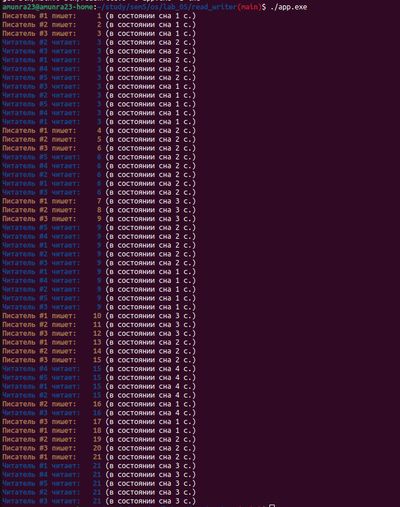

# Операционные системы (5 семестр)

 [Я в Телеграм](https://t.me/amunra2) 

# Лабораторная работа №5 (Читатель-Писатель)

## Цель

Целью данной работы является написание программы `Читатель-Писатель` на семафорах.


## Запуск

Запуск программы производится через `Make` файл.

1. Установить необходимый пакет `make`.

2. Собрать исполняемый файл
   
```bash
make
```

3. Запустить
   
```bash
./app.exe
```

## Пример




_@amunra2 (2021г.)_
